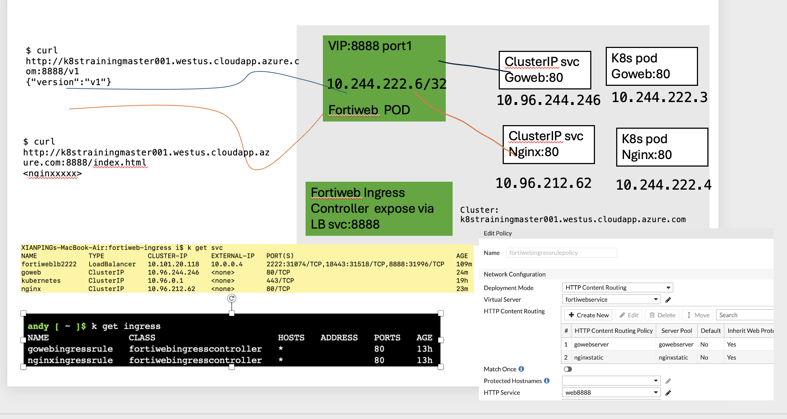

# fortiwebingress


- git clone
```
git clone https://github.com/yagosys/fortiwebingress.git
cd fortiwebingress

```
- create aks or self-manged k8s

## create AKS 
if AKS already existed, you can skip this step
if you want create aks on existing resourcegroup, change the variable value resourcegroupname to your existing resourcegroup

```
location="westus"
resourcegroupname="demofortiwebingresscontroller"

az group create --location $location --resource-group $resourcegroupname

[ ! -f ~/.ssh/id_rsa ] && ssh-keygen -q -N "" -f ~/.ssh/id_rsa
clustername=$(whoami)-aks-cluster

az aks create \
    --name ${clustername} \
    --node-count 1 \
    --vm-set-type VirtualMachineScaleSets \
    --network-plugin azure \
    --service-cidr  10.96.0.0/16 \
    --dns-service-ip 10.96.0.10 \
    --nodepool-name worker \
    --resource-group $resourcegroupname

##update kubeconfig file for kubectl to use 
az aks get-credentials -g  $resourcegroupname -n ${clustername} --overwrite-existing
```

## or Create self managed K8s  

```bash
./create_kubeadm_k8s_on_ubuntu22.sh
```

install metallb loadbalancer
```
./ingressmetallbforkubeadmk8s.sh
```
## Deploy fortiweb and ingress controller 
- deploy fortiweb pod
```
./deploy_fortiweb_expose_slb.sh
```

- deploy fortiwebingresscontroller 
```
./deploy_fortiwebingresscontroller.sh
```
- deploy demo application 

```
./deploy_demo_application.sh

```
## Deploy demo ingress rule 
- deploy demo ingress rule

when deploy ingress rule, ingresscontroller will detect it and create the rule in fortiweb pod
```
kubectl apply -f ingress.yaml

```
or deploy tls version
```
kubectl apply -f ingresstls.yaml
```
to use tls, the certificate indicated in the yaml file has to be prepared and upload to fortiweb.
if the certificate does not exist, the fortiweb default certificate will be used.


## Verify 
- verify 
```
ip=$(kubectl get cm ssh-config -o json | jq -r .data.SSH_HOST)
port="8888"
curl http://$ip:$port/v2
curl http://$ip:$port/index.html
```
for https, use curl https instead


- Check fortiwebingresscontroller log

```
podname=$(kubectl get pod -l app=fortiwebingresscontroller -o json | jq -r .items[].metadata.name)
kubectl logs po/$podname  -c fortiwebingresscontroller
kubectl logs po/$podname -c ssh-setup
```
## Delete demo ingress rule 

- delete demo ingress rule
```
kubectl delete -f ingress.yaml
```

## clean up 

- delete aks cluster
```
az aks delete --name ${clustername} -g $resourcegroupname  -y
```
- delete resourcegroup
```
az group delete -g  $resourcegroupname
```
